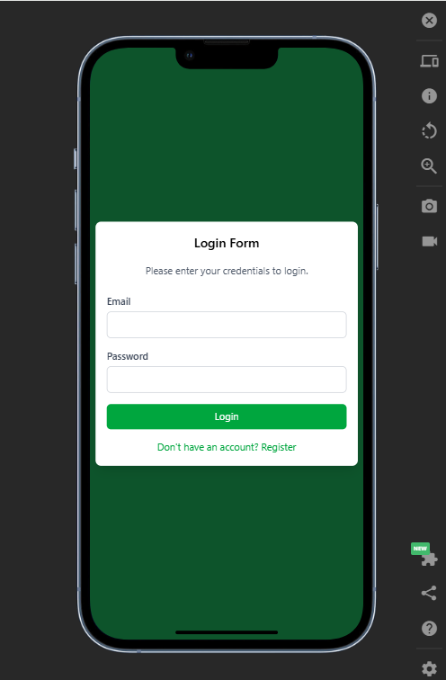
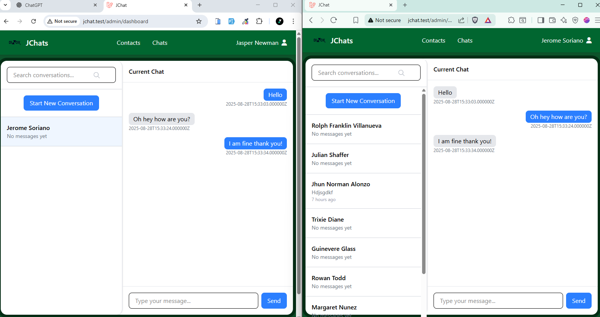

# JCHAT

- This is a sample app built in laravel livewire, with laravel reverb as the websocket server, and laravel Echo and Pusher.

## Screenshots

## Developer

- [Jerome Soriano](https://github.com/dvxgit-jsoriano)

*"Feel free to read, use, and apply to your projects."*